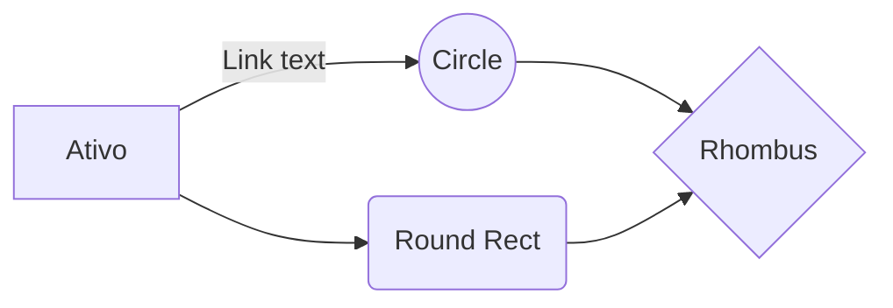

<h1 align="center">Análise Fundamentalista de Fundos Imobiliários</h1>

_**Principais Indicadores:**_
- Quantidade de Ativos
-  Área Bruta Locável
- Multi localidade
- Multi inquilino
- Localidade dos Ativos
- Estado dos Ativos
- Vacância
- Prazo
- Data Validade Contratos
- Data Constituição do Fundo
- Volume de Negociação
- PVP
- Dividend Yeld (médio)
-  Inadimplência
-  Fontes de Renda

<!--stackedit_data:
eyJoaXN0b3J5IjpbMTQ3NzIyMDc0Nyw1NDQzMDA5MzcsMTM4MT
QwNzcwMiwxMTM2ODk2NTY1LDQyNTUzOTAzMCwxNzM4Nzg5Mzcw
XX0=
-->